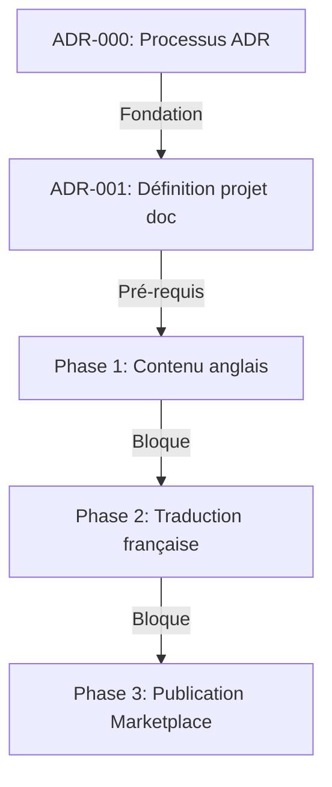

---
# 🤖 Machine-Readable Metadata (Frontmatter YAML)
# Permet parsing automatique par agents IA et recherche/filtrage avancé

# ⚠️ AVANT DE COMMENCER:
# 1. Lire ADR-000 (Processus) : ./000-META-processus-creation-adr.md
# 2. Consulter TAXONOMY.md pour classification complète
# 3. Vérifier README.md pour numérotation disponible dans votre plage
# 4. Ces 4 documents DOIVENT être cohérents - les consulter ensemble

adr: XXX  # Remplacer par numéro dans plage catégorie (voir 000-META)
title: "[Titre Descriptif de la Décision]"
status: "proposed"  # proposed|accepted|rejected|deprecated|superseded
date: YYYY-MM-DD
superseded_by: null
replaces: null
related_adrs: []  # Numéros ADRs liés
related_issues: []  # Issues GitHub liées

# 🗂️ Taxonomie ADR (Voir TAXONOMY.md pour détails complets)
classification:
  # Lifecycle: État dans le cycle de vie
  lifecycle: "proposed"  # proposed|accepted|rejected|deprecated|superseded
  
  # Domain: Domaine architectural principal (voir plages 000-META)
  # meta|biz|doc
  domain: "biz"
  
  # Impact: Niveau d'impact sur le projet
  impact: "medium"  # low|medium|high|critical
  
  # Quality Attributes (ASR): Qualités affectées (ISO 25010)
  quality:
    - "usability"         # lisibilité, clarté, accessibilité utilisateur
    - "compliance"        # Azure Marketplace requirements, trademark, policies
    - "maintainability"   # facilité de mise à jour, cohérence EN/FR
    # Autres: reliability, traceability, portability
  
  # Reversibility: Facilité de changement
  reversibility: "moderate"  # easy|moderate|hard|irreversible
  
  # Scope: Portée de la décision
  scope: "tactical"  # strategic|tactical|operational
  
  # Technology Area: Domaines technologiques concernés
  tech_areas:
    - "azure"
    - "marketplace"
    - "nextcloud"
    # Autres: partner-center, wiki, documentation

# Tags libres pour recherche flexible
tags: ["azure-marketplace", "documentation", "nextcloud"]

# Stakeholders impliqués
stakeholders: ["@cotechnoe"]

# Effort estimé d'implémentation
effort: "medium"  # low|medium|high
---

# ADR XXX: [Titre Descriptif de la Décision]

<!-- PLACEHOLDER: Remplacer XXX par le prochain numéro séquentiel dans la plage de catégorie -->
<!-- PLACEHOLDER: Remplacer [Titre Descriptif] par un titre concis et actionable -->

## 📊 Vue d'Ensemble

| Attribut | Valeur |
|----------|--------|
| **Statut** | 🔄 Proposé |
| **Date Décision** | YYYY-MM-DD |
| **Stakeholders** | @cotechnoe |
| **Impact** | 🔴 Élevé / 🟡 Moyen / 🟢 Faible |
| **Effort Implémentation** | 🔴 Élevé / 🟡 Moyen / 🟢 Faible |
| **Risque** | 🔴 Élevé / 🟡 Moyen / 🟢 Faible |

<!-- PLACEHOLDER: Remplir le tableau ci-dessus avec les valeurs réelles -->

---

## 🎯 Contexte & Problème

<!-- PLACEHOLDER: Décrire le contexte et le problème ci-dessous -->
<!-- FORMAT: Paragraphes explicatifs + réponses aux questions guidées -->

### Questions Guidées

**1. Quel problème essayons-nous de résoudre?**
- [Décrire le problème principal dans le contexte nextcloud-azure-marketplace-doc]
- [Impact actuel sur la documentation publiée, la certification Marketplace, ou l'expérience utilisateur]

**2. Quelles sont les contraintes et exigences?**
- **Contenu** : [Ex: conformité Microsoft Writing Style Guide, audience utilisateur final]
- **Azure Marketplace** : [Ex: exigences Partner Center, Support URL valide, certification]
- **Marques** : [Ex: Nextcloud GmbH trademark, Microsoft trademark guidelines]
- **Bilingue** : [Ex: politique English First, synchronisation EN/FR]

**3. Quel est l'impact si nous ne prenons pas de décision?**
- **Court terme (0-3 mois)**: [Impact sur la certification ou l'expérience utilisateur]
- **Moyen terme (3-12 mois)**: [Risque pour le maintien du listing Marketplace]
- **Long terme (12+ mois)**: [Impact sur l'adoption par les universités]

**4. Quels facteurs influencent cette décision?**
- **Exigences Microsoft Marketplace** : [Politiques de certification, Partner Center]
- **Audience cible** : [Administrateurs systèmes d'universités et centres de recherche]
- **Conformité marque** : [Trademark Nextcloud GmbH, Microsoft Trademark Guidelines]
- **Maintenabilité** : [Synchronisation EN/FR, cycle de publication de l'offre]

---

## ✅ Décision

<!-- PLACEHOLDER: Décrire la décision prise ci-dessous -->
<!-- FORMAT: Approche + Justification + Principes appliqués -->

### Approche Choisie

[Décrire en détail la solution retenue]

**Exemple**:
> Nous adoptons **[solution choisie]** pour [objectif] afin de [bénéfice principal].
> Cette approche garantit [propriété clé] tout en respectant les exigences Azure Marketplace.

### Comment Cette Solution Résout le Problème

[Expliquer point par point comment la décision répond au problème]

1. **Problème X** → Résolu par [mécanisme Y]
2. **Exigence Marketplace Z** → Satisfaite via [approche W]
3. **Contrainte marque** → Adressée par [solution]

### Principes Appliqués

- ✅ **English First** : [Version anglaise canonique rédigée en premier]
- ✅ **Audience unique** : [Contenu centré sur l'utilisateur Marketplace final]
- ✅ **Conformité Microsoft** : [Respect Microsoft Writing Style Guide et policies]
- ✅ **Traçabilité** : [Liens OCID/UTM pour mesure du trafic]
- ✅ **[Autre principe]** : [Description]

---

## 📊 Matrice de Décision Quantifiée

<!-- PLACEHOLDER: Remplir le tableau ci-dessous avec les scores réels -->
<!-- FORMAT: Évaluation objective sur 10 pour chaque critère -->

| Critère | Poids | Alternative 1 | Alternative 2 | Décision Choisie | Notes |
|---------|-------|---------------|---------------|------------------|-------|
| **Conformité Marketplace** | 30% | 🟡 Moyen (5/10) | 🟢 Élevé (9/10) | 🟢 Élevé (10/10) | Exigences Microsoft |
| **Expérience utilisateur** | 25% | 🟡 Moyen (6/10) | 🟢 Élevé (8/10) | 🟢 Élevé (9/10) | Clarté, accessibilité |
| **Maintenabilité** | 20% | 🟢 Simple (8/10) | 🟡 Moyen (5/10) | 🟢 Simple (8/10) | Synchronisation EN/FR |
| **Conformité marque** | 15% | 🟡 Moyen (6/10) | 🟢 Élevé (8/10) | 🟢 Élevé (9/10) | Trademark guidelines |
| **Effort rédaction** | 10% | 🟢 Faible (8/10) | 🔴 Élevé (4/10) | 🟡 Moyen (7/10) | Temps de production |
| **Score Total Pondéré** | 100% | **6.30** | **7.45** | **9.05** ⭐ | Winner |

### Calcul Détaillé (Pour Validation IA)

```
Alternative 1: (5*0.30) + (6*0.25) + (8*0.20) + (6*0.15) + (8*0.10) = 6.30
Alternative 2: (9*0.30) + (8*0.25) + (5*0.20) + (8*0.15) + (4*0.10) = 7.45
Décision:      (10*0.30) + (9*0.25) + (8*0.20) + (9*0.15) + (7*0.10) = 9.05 ✅
```

---

## ⚖️ Conséquences

### ✅ Positives (Bénéfices)

| Bénéfice | Métrique Cible | Valeur Attendue | Mesure |
|----------|----------------|-----------------|--------|
| Conformité Marketplace | Certification Microsoft | ✅ Certifié | Support URL vérifiée |
| Expérience utilisateur | Pages wiki complètes | 10 pages EN + 10 FR | Audit contenu |
| Maintenabilité | Temps de sync EN→FR | < 24h par release | Git log |

### ⚠️ Négatives (Risques & Limitations)

| Risque | Impact | Probabilité | Mitigation | Responsable | Deadline |
|--------|--------|-------------|------------|-------------|----------|
| Changements policies Marketplace | 🟡 Moyen | 🟡 Moyen | Veille Microsoft tous les 3 mois | @cotechnoe | Trim. |
| Divergence EN/FR | 🟡 Moyen | 🟡 Moyen | Check-list avant chaque publication | @cotechnoe | Par release |
| **Évolution UI Nextcloud Hub** | 🟡 Moyen | 🟡 Moyen | Screenshots testés sur image courante | @cotechnoe | Continu |

---

## 🔄 Alternatives Considérées

### Alternative 1: [Nom Descriptif]

**Description**:
[Brève description de l'alternative]

**Avantages**:
- ✅ [Avantage 1]
- ✅ [Avantage 2]

**Inconvénients**:
- ❌ [Inconvénient 1]
- ❌ [Inconvénient 2]

**Rejetée parce que**:
[Raisons principales du rejet, référence à la matrice de décision]

**Score Matrice**: 6.30/10

---

### Alternative 2: [Nom Descriptif]

**Description**:
[Brève description]

**Avantages**:
- ✅ [Avantage 1]

**Inconvénients**:
- ❌ [Inconvénient 1]

**Rejetée parce que**:
[Raisons]

**Score Matrice**: 7.45/10

---

## 🚀 Plan d'Implémentation

### Phases & Deliverables

| Phase | Durée Estimée | Deliverables | Blockers Potentiels | Critères de Validation | Responsable |
|-------|---------------|--------------|---------------------|------------------------|-------------|
| **Phase 1: Contenu anglais** | 1 semaine | - Pages wiki EN complètes<br>- README.md mis à jour | - Accès Partner Center<br>- Validation contenu | - Toutes pages EN finalisées<br>- Liens vérifiés | @cotechnoe |
| **Phase 2: Traduction française** | 3 jours | - Pages wiki FR générées<br>- Liens bidirectionnels EN↔FR | - Phase 1 terminée | - Chaque page FR synchronisée avec EN | @cotechnoe |
| **Phase 3: Publication** | 1 jour | - Support URL vérifiée<br>- Badge GTM Toolkit en place<br>- Liens OCID/UTM ajoutés | - Phases 1+2 terminées | - Support URL accessible incognito<br>- Offre certifiée | @cotechnoe |

### Dépendances & Ordre d'Exécution



---

## 🎯 Critères de Succès & Validation

### Métriques de Succès (Post-Implémentation)

| Métrique | Valeur Cible | Valeur Baseline | Statut Actuel | Date Mesure |
|----------|--------------|-----------------|---------------|-------------|
| **Support URL valide** | ✅ Accessible | Non vérifiée | ⏳ En cours | - |
| **Pages wiki EN complètes** | 10 pages | 0 | ⏳ À mesurer | - |
| **Pages wiki FR synchronisées** | 10 pages | 0 | ⏳ À mesurer | - |
| **Certification Microsoft** | ✅ Certifiée | Non certifiée | ⏳ En cours | - |

### Critères de Re-évaluation

**Déclencher une review complète si**:
- ⚠️ Changement majeur exigences Microsoft Marketplace
- ⚠️ Nouvelle version majeure Nextcloud Hub disponible
- ⚠️ Changement des Trademark Guidelines Nextcloud GmbH
- ⚠️ Retour utilisateur signalant une documentation incorrecte

**Responsable Review**: @cotechnoe  
**Fréquence Review Planifiée**: À chaque publication d'une nouvelle version de l'offre

---

## 🔗 Traçabilité & Liens

### Issues GitHub Liées

| Issue | Type | Relation | Description |
|-------|------|----------|-------------|
| [#XX](link) | Feature | **Origine** | [Description de l'issue qui a motivé cet ADR] |

### ADRs Connexes

| ADR | Titre | Relation | Impact |
|-----|-------|----------|--------|
| [ADR-000](000-META-processus-creation-adr.md) | Processus ADR | **Processus** | Gouvernance ADR |
| [ADR-801](801-BIZ-strategie-documentation-marketplace.md) | Stratégie Documentation Marketplace | **Politique** | Règles de contenu |
| [ADR-802](802-BIZ-sources-officielles-azure-marketplace.md) | Sources Officielles Marketplace | **Références** | Sources canoniques |

### Documentation Externe

- [Microsoft Marketplace VM Offer](https://learn.microsoft.com/en-us/partner-center/marketplace-offers/marketplace-virtual-machines)
- [Nextcloud Documentation](https://docs.nextcloud.com/)
- [Microsoft Writing Style Guide](https://learn.microsoft.com/en-us/style-guide/welcome/)
- [GTM Best Practices](https://learn.microsoft.com/en-us/partner-center/marketplace-offers/gtm-best-practices)

---

## 📝 Notes & Historique

### Changelog

| Date | Auteur | Changement | Raison |
|------|--------|------------|--------|
| YYYY-MM-DD | @cotechnoe | Création initiale | Issue #XX |

---

## 🤖 Métadonnées IA (Machine-Only)

```json
{
  "adr_id": "XXX",
  "project": "nextcloud-azure-marketplace-doc",
  "parsing_version": "2.0",
  "generated_at": "YYYY-MM-DDTHH:mm:ssZ",
  "validation_status": "valid",
  "dependency_graph": {
    "depends_on": [],
    "blocks": [],
    "related": []
  }
}
```

---

## 📋 Instructions d'Utilisation

### Pour Humains

1. **Copier ce template**: `cp adr-template-ai-optimized.md XXX-CATÉGORIE-titre-decision.md`
2. **Choisir la catégorie** et **numéro dans la plage** :
   - META (000-099) : gouvernance, processus, contraintes IA
   - BIZ (800-899) : stratégie documentation, conformité Marketplace, marques
3. **Remplacer XXX** : Par le prochain numéro disponible dans la plage de votre catégorie
4. **Remplir frontmatter YAML** : Métadonnées + classification 7 dimensions
5. **Compléter placeholders** : Chercher `<!-- PLACEHOLDER:` et remplacer
6. **Remplir matrice décision** : Évaluer objectivement chaque critère sur 10
7. **Valider avec équipe** : Review par @cotechnoe
8. **Committer** : `git commit -m "docs(adr): ADR-XXX [CATÉGORIE] Titre"`
9. **Ajouter à l'index** : Mettre à jour `docs/adr/README.md`

**Exemples noms fichiers (contexte nextcloud-azure-marketplace-doc)** :
```bash
000-META-processus-creation-adr.md                           # Méta (000-099)
001-META-definition-projet-nextcloud-azure-marketplace-doc.md # Méta (000-099)
002-META-agent-ia-non-hallucination.md                       # Méta (000-099)
801-BIZ-strategie-documentation-marketplace.md               # Business (800-899)
802-BIZ-sources-officielles-azure-marketplace.md             # Business (800-899)
803-BIZ-titre-offre-marketplace-conformite-marque.md         # Business (800-899)
```

---

## ✅ Checklist Complétude

### Minimum Requis (Obligatoire)
- [ ] Frontmatter YAML rempli (adr, title, status, date, classification)
- [ ] Section Contexte complète (≥ 200 mots)
- [ ] Section Décision complète (≥ 150 mots)
- [ ] Matrice décision avec ≥ 3 critères
- [ ] Conséquences positives ET négatives listées
- [ ] ≥ 2 alternatives considérées
- [ ] Plan implémentation avec phases
- [ ] Critères de succès définis

### Recommandé (Haute Valeur)
- [ ] Métriques quantifiées dans conséquences
- [ ] Stratégies mitigation pour risques élevés
- [ ] Dépendances ADRs/Issues explicites
- [ ] Références documentation Microsoft Marketplace
- [ ] Conformité marque vérifiée (Nextcloud GmbH + Microsoft)
- [ ] Règle 5 respectée : aucune référence au dépôt build `Cotechnoe/nextcloud-marketplace`

---

**Version Template**: 2.0 (AI-Optimized)  
**Dernière Mise à Jour**: 2026-05-25  
**Projet**: nextcloud-azure-marketplace-doc  
**Compatibilité**: Agents IA (ChatGPT, Claude, Copilot) + Humains
